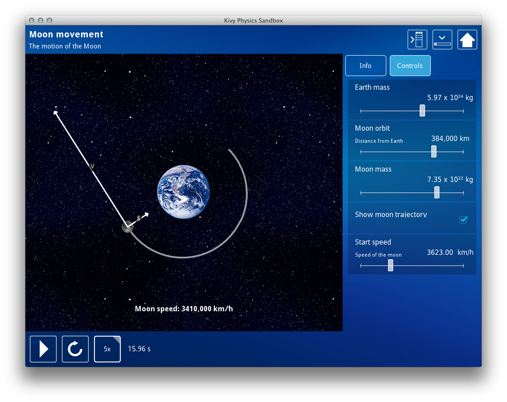
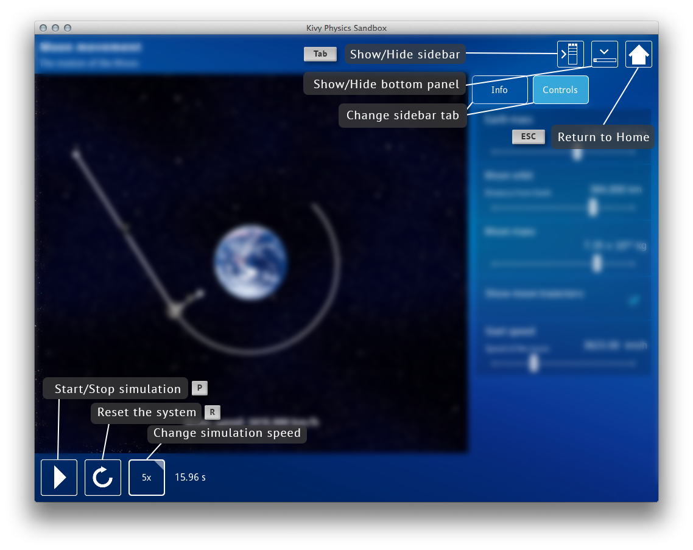

Kivy Physics Sandbox
====================

Kivy Physics Sandbox is educational application for visualizing different physics-based experiments.

The main feature of this application is interactivity and ability to quickly develop new experiments using application' provided classes.

Works on Windows, Ubuntu, OS X, Android tablet and Android phone (but difficult to use).

Installation
============

#### Linux

```bash
git clone https://github.com/Gipzo/kivy-physics-sandbox.git
pip install -r requirements.txt
```

Run application by executing `python main.py`

#### Mac OS

[Mac OS X Release](https://github.com/Gipzo/kivy-physics-sandbox/releases/download/0.1/KivyPhysicsSandbox-osx.dmg)

#### Windows

[Win32 Release](https://github.com/Gipzo/kivy-physics-sandbox/releases/download/0.1/KivyPhysicsSandbox-win32.exe)

#### Android

[Android APK](https://github.com/Gipzo/kivy-physics-sandbox/releases/download/0.1/KivyPhysicsSandbox-android-debug.apk)

Screenshots
===========





Keyboard control (for PC)
=========================


Experiments
===========

Currently there are 4 experiments in 2 categories:

    Kinetics
        Cannon
        Moon movement
        Speed relativity
    Optics
        Refraction

Experiments are dynamically populated from `experiments` folder. Each experiment must have this folder structure:

    experiments/
      __init__.py
      <category>/
        __init__.py
        category.json  # Category information: title and icon file
        <experiment_name>
          __init__.py
          experiment.json  # Experiment information: title, short description and icon file
          description.rst  # Description in RST format
          experiment.py    # Main experiment file
      
`experiment.py` file must have `load_experiment` function that returns class, that must be inherited from `ExperimentWindow` class.

## Classes

### ExperimentWindow

This is the main experiment class.

#### Parameters

`time` - when application is in **play** mode (when play button is pressed), this parameter stores current simulation time

`experiment_path` - stores path to experiment folder

`live` - shows if application is in **play** mode

`can_change_speed` - if `True` user can change the speed of simulation (default: `True`)

#### Methods

`get_file(file)` - returns full path to `file`. `file` should be relative to experiment folder. You can use this to get path of images or other data.

`load()` - this method is executed when experiment is selected. Use it to build widgets and layout.

`reset()` - this method is executed when user press **Reset** button.

`update(*largs)` - this method is executed when:
    - application is in **play** mode this method is executed every `dt` seconds. `dt` should be `largs[1]`
    - user changes controls' values. This method is executed with default kivy parameters: widget and value.
    You can use `self.live` parameter to change only live values.
    
Simple solution to make both work is this:

```
def update(self, *largs):
    try:
        dt = float(largs[0])
    except:
        dt = 0.0
```

You can also use default kivy method `on_size` to set widgets' sizes and position

## Additional classes

### PhysicsObject

This class is useful to draw different physical objects that could be rotated and to draw vectors on them.

#### Parameters

`angle` - image rotation, in degrees (default: 0)

`source` - source image for display (default: '')

`scale` - scale of image and vectors (default: 1.0)

`color` - image color tint (default: [1,1,1,1])

`constraints` - list `[MIN_X, MAX_X, MIN_Y, MAX_Y]` which holds boundaries for object.
Use `after_update` method to return object to it's boundaries. (default: [0, 100, 0, 100])

`constraint_x` - check for X-axis boundary, (default: True)

`constraint_y` - check for Y-axis boundary, (default: True)

`show_trajectory` - if set to True - draw trajectory of object (default: False)

#### Methods

`update(dt)` - if you inherit from PhysicsObject class, you can calculate movement and set object position in this method. Don't forget to call *super* method to calculate trajectory

`clear_trajectory()` - clears object trajectory

`add_vector(self, name, title, length, angle=0.0, color=(1, 1, 1, 1), mode='object')` - adds vector. `mode` parameter is currently not used

`update_vector(self, name, length, angle)` - updates vector with name `name`

### TexturedWidget

This widget is used to draw tiled textured areas.

#### Parameters

`source` - texture file path

`offset_x`, `offset_y` - texture offset on X-axis and Y-axis. Used to make "flowing" textures (default: 0, 0)

`scale` - texture scale (default: 1.0)

`color` - color tint of texture (default: [1, 1, 1, 1])

### LineWidget

Simple widget to draw line

#### Parameters

`start` - X and Y coordinate of line start point (default: (0.0, 0.0))

`end` - X and Y coordinate of line end point (default: (100.0, 100.0))

`width` - width of the line, in pixels (default: 1.0)

`color` - color of the line (default: [1, 1, 1, 1] )


    

